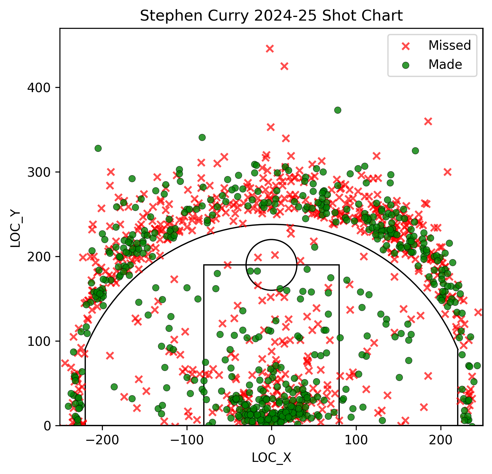

# NBA Shooting Analytics — Stephen Curry 2024–25

This project analyzes **Stephen Curry’s 2024–25 NBA regular-season shooting data**, including:
✔ Shot chart (made vs missed)  
✔ Court visualization (accurate NBA proportions)  
✔ Zone-based shooting summary  
✔ Automated data pulling with NBA API  

A full sports-analytics project combining **basketball knowledge**, **statistics**, and **data visualization**, suitable for portfolio and sports-related academic applications.

---

## 📌 Project Features

### 🔥 1. Automated Data Collection  
- Uses `nba_api` to download official NBA shot chart data  
- Includes shot coordinates (LOC_X, LOC_Y), distance, shot type, zone info, etc.

### 🎯 2. Accurate NBA Court Drawing  
Court is drawn using true NBA dimensions:
- 94 ft × 50 ft  
- 22 ft corner threes  
- 23.75 ft arc  
- Paint, key, rim & backboard  
Visually aligned with NBA API’s coordinate system.

### 📊 3. Shot Chart Visualization  
- Made shots = green dots  
- Missed shots = red dots  
- High-quality plotted court with curved + straight 3PT line  
- Clean and readable for scouting-style analysis  

### 📈 4. Shooting Zone Summary  
Automatic summary like:

| Zone | Att | Made | FG% |
|------|-----|------|------|
| Overall | 1258 | 564 | 44.8% |
| 3PT | 784 | 311 | 39.7% |
| 2PT | 474 | 253 | 53.4% |
| Restricted Area | 162 | 104 | 64.2% |
| In The Paint | 182 | 84 | 46.2% |
| Mid-Range | 130 | 65 | 50.0% |

(Example values)

---

## 📂 Project Structure
nba-sports-analytics/
│── notebooks/                # Jupyter Notebooks
│── reports/                  # PDF reports
│── slides/                   # Presentation slides
│── curry_shotchart.py        # Main Python script
│── curry_shotchart_court.png
│── curry_2024_25_shooting_summary.csv
│── README.md
---

## 🏀 Example Visualization

### **Stephen Curry 2024–25 Shot Chart**
(Generated from this project)



---

## 📁 Data Source

Data is provided via:
- **NBA API (`nba_api`)**
- Endpoint: `shotchartdetail`
- Season: **2024–25 Regular Season**
- Data matches NBA.com/stats backend  

---

## 🛠 Tech Stack

| Category | Tools |
|---------|-------|
| Language | Python 3.9 |
| Data | nba_api, pandas |
| Visualization | matplotlib |
| Notebook | Jupyter |
| Others | numpy |

---

## 🚀 How to Run

### 1. Clone the repository
```bash
git clone https://github.com/Fengjui1226/nba-sports-analytics.git
cd nba-sports-analytics
```
### 2. Install dependencies
```bash
pip install nba_api pandas matplotlib
```
### 3. Run the main script
```bash
python3 curry_shotchart.py
```
### 4. Or open the Jupyter Notebook
```bash
notebooks/curry_shotchart.ipynb
📌 Key Insights
	•	Curry maintains elite 3PT efficiency (~40%)
	•	Restricted-area finishing >64% (above league average for guards)
	•	Higher volume from left wing & top-of-the-key threes
	•	Corner 3s remain low in frequency
	•	Mid-range attempts limited but very efficient
```

---

🔮 Future Improvements
	•	Heatmap / Hexbin version of shot chart
	•	Season-to-season comparison
	•	Player-to-player comparison (Curry vs Lillard / Trae Young)
	•	Expected FG% (xFG%) model
	•	Streamlit interactive dashboard

---

👤 Author

劉豐睿 (Ryder Liu)
NCCU MIS |Sports Enthusiast
GitHub: https://github.com/Fengjui-Liu

